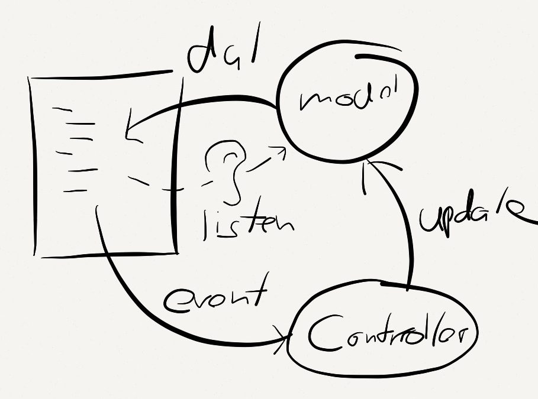

# Introduction

## Architecture

In Serenade.js you define templates and render them, handing in a controller
and a model to the template. Serenade.js then handles getting values from the
model and updating them dynamically as the model changes, as well as
dispatching events to the controller when they occur. Templates are
"logic-less" in that they do not allow the execution of any code, instead they
declaratively define what data to bind to and which events to react to and how.



## Hello world

The hello world example:

``` javascript
var element = Serenade.view('h1 "Hello World"').render();
document.body.appendChild(element);
```

As you can see we are rendering a view, which returns a DOM element. We then
insert this element into the body.

Let's throw in some data:

``` javascript
var model = { name: "Jonas" };

var element = Serenade.view('h1 "Hello " @name').render(model);
document.body.appendChild(element);
```

Now the `render` function takes a regular JavaScript object as its first
parameter.  We can access this data in the template.

## DOM events and controllers

We'll add a controller to receive events:

``` javascript
var controller = { say: function(element, model) { alert("Hello " + model.name) } };
var model = { name: "Jonas" };

var element = Serenade.view('button[event:click=say] "Say hello"').render(model, controller)
document.body.appendChild(element)
```

The controller is the second argument to `render`. Event bindings are declared
in the view, and when the view is rendered, the events are attached to the
rendered elements. Since Serenade's `render` function returns an actual DOM
element, as opposed to returning a string, you don't need to do anything else
than inserting that element into the DOM for everything to just work.

## Pure JavaScript

In this example, both model and controller are just regular JavaScript objects.
There is no need to inherit from any special base classes. This allows you to
use Serenade for quick inline scripts, and even as a template engine.

Serenade derive its power from the fact that it can listen to changes made to
model data. Unfortunately JavaScript does not have any facility for listening
to changes to arbitrary properties. Learn more about how to keep your templates
always up to date under [Binding data](binding_data.html).

## Registering views

We will probably want to save the view so that we can render it multiple times,
just give it a name:

``` javascript
Serenade.view('hello_world', 'h1 "Hello World"');
```

And you can render it later, through the global `Serenade.render` function:

``` javascript
var element = Serenade.render('hello_world', model, controller);
document.body.appendChild(element);
```

There are more advanced examples in the `examples` folder, check out a live
demo of those examples running [here](http://serenade.herokuapp.com/). There is
also an implementation of the [todomvc app using
Serenade.js](https://github.com/elabs/serenade_todomvc).
